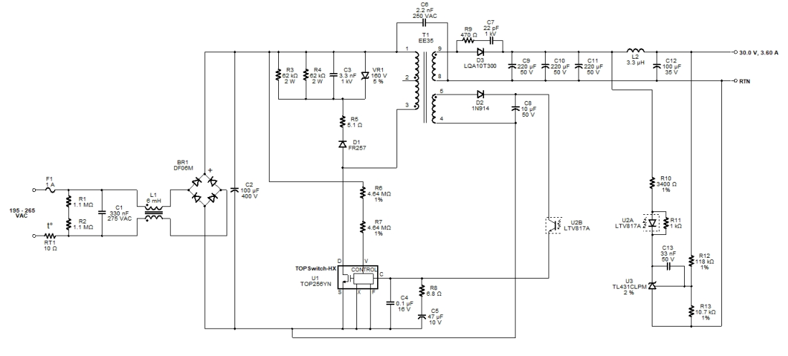

# 30V-3A-switched-mode-power-supply
30V-3A Switched-mode Power Supply

Elements specifications, device variables, transformer construction parameters, board layout, electrical and mechanical diagrams, and winding instruction are all availabe in the *PI Circuit, Specification.pdf* file.
